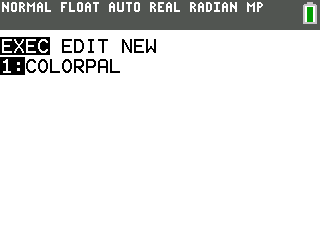

This program sets the calculator to handle drawing to the lcd using the 8bpp format. This program also initializes an appropriate 8bpp indexed color schema using the 1555 (lsb-green(1), r(5),g(5),b(5)) palette schema.

Exit the program by pressing on the `clear` key.

Pressing any key will cause the program to cycle through the colors starting at the palette index 255 (White) until it reaches index 0 (Black).

